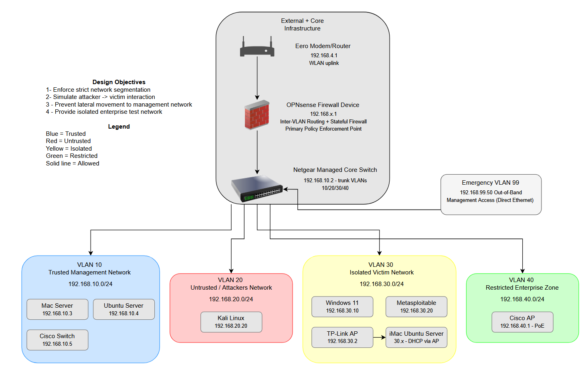
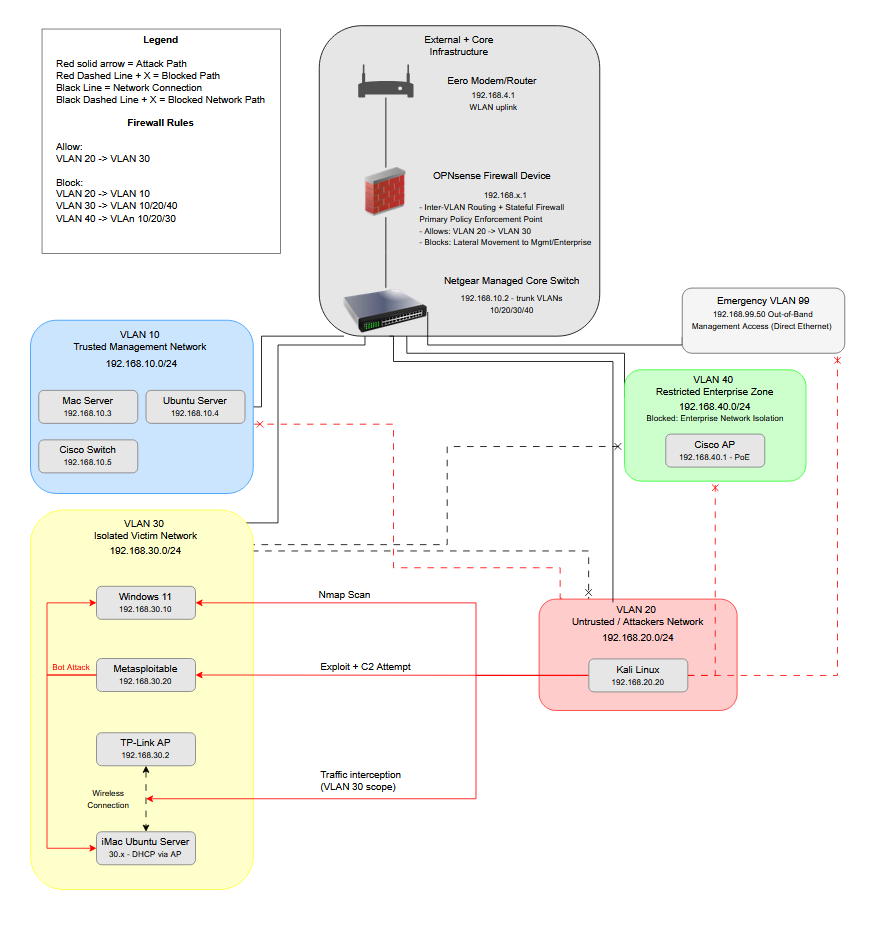

# Home Cybersecurity Lab — Infrastructure Documentation

> **Purpose-built network security lab supporting offensive/defensive research, enterprise simulation, and hands-on security engineering practice.**

---

## Overview

This repository contains complete infrastructure documentation for a physical home cybersecurity lab designed and operated by a graduate student entering Carnegie Mellon University's **MSISPM** program. The lab is built to support real penetration testing exercises, network defense research, and security tooling development in a fully isolated, production-grade environment.

The lab is not a collection of VMs on a laptop. It is a physically segmented network with dedicated hardware — a stateful firewall, two managed switches, a hypervisor, multiple physical servers, enterprise and vulnerable wireless access points, and a carefully designed VLAN architecture that enforces realistic security boundaries.

All documentation in this repository is written to professional infrastructure standards — the same level of rigor expected of a junior security engineer documenting a team environment.

---

## Lab At a Glance

| Component | Details |
|-----------|---------|
| **Firewall** | OPNsense — inter-VLAN routing, stateful inspection, primary policy enforcement |
| **Core Switch** | Netgear Managed — 8-port, trunks VLANs 10/20/30/40 |
| **Enterprise Switch** | Cisco Catalyst 2960 Plus SI PoE-8 — Layer 2, VLAN 40 distribution |
| **Hypervisor** | Mac Server running UTM — hosts 4 VMs across 3 isolated NICs |
| **VLANs** | 4 production segments + Emergency VLAN 99 |
| **Attack Surface** | Kali Linux (VLAN 20) → Windows 11, Metasploitable, iMac Ubuntu Server (VLAN 30) |
| **Enterprise Sim** | Cisco AP on VLAN 40 via PoE |
| **Vulnerable Wireless** | TP-Link AP on VLAN 30 — intentional weak config |
| **Management Workstation** | Alienware m16 R2 — Intel Ultra 9 185H, 64GB RAM, RTX 4070 |

---

## Network Architecture

The lab is divided into five VLAN segments, each representing a distinct trust zone. All inter-VLAN routing passes through OPNsense — there is no switch-level routing. The firewall enforces a deny-by-default policy: every permitted traffic flow is explicitly defined and justified.

| VLAN | Name | Subnet | Trust Level |
|------|------|--------|-------------|
| 10 | Management | 192.168.10.0/24 | Trusted |
| 20 | Attackers | 192.168.20.0/24 | Untrusted |
| 30 | Victims | 192.168.30.0/24 | Isolated |
| 40 | Enterprise | 192.168.40.0/24 | Restricted |
| 99 | Emergency | 192.168.99.0/24 | Out-of-band |

---

## Attack Flow

The primary lab use case is controlled attacker → victim simulation. Kali Linux (VLAN 20) is permitted to reach the victim segment (VLAN 30) and enterprise segment (VLAN 40) through explicit firewall rules. All attack traffic traverses OPNsense, enabling full logging and detection exercises. Lateral movement to the management plane (VLAN 10) is blocked at the firewall regardless of attacker position.

---

## Documentation

| # | Document | Description |
|---|----------|-------------|
| 01 | [Architecture Overview](docs/01-architecture-overview.md) | Full topology, design objectives, infrastructure and VM tables |
| 02 | [VLAN Design](docs/02-vlan-design.md) | Segment definitions, trust model, inter-VLAN communication matrix |
| 03 | [IP Addressing Plan](docs/03-ip-addressing-plan.md) | Subnet allocations, device type blocks, assigned addresses |
| 04 | [Firewall Rules](docs/04-firewall-rules.md) | Per-interface rules with policy rationale for every rule |
| 05 | [Device Inventory](docs/05-device-inventory.md) | Complete hardware and VM inventory with roles and IPs |
| 06 | [Port Mapping](docs/06-port-mapping.md) | Switch port assignments, trunk configs, physical cabling summary |
| 07 | [Security Design Philosophy](docs/07-security-design-philosophy.md) | Rationale behind every major architectural decision |
| 08 | [Recovery Procedures](docs/08-recovery-procedures.md) | Backup strategy, firewall lockout recovery, VM restore, full rebuild |
| 09 | [Future Roadmap](docs/09-future-roadmap.md) | Planned projects and capability expansions |

---

## Diagrams

| Diagram | Description |
|---------|-------------|
| [Architecture Diagram](diagrams/architecture-diagram.png) | VLAN topology, device placement, trust zone color coding |
| [Attack Flow Diagram](diagrams/attack-flow-diagram.png) | Permitted and blocked traffic paths, active attack simulation flows |
| [Visual Network Diagram](diagrams/visual-network-diagram.png) | Simplified hierarchical view of network layout and VLAN membership |

See [diagrams/README.md](diagrams/README.md) for full captions and legend.

---

## Security Boundaries

The three most important security constraints enforced in this lab:

**1. Management plane is unreachable from all lab VLANs**
VLAN 10 cannot be accessed by the attacker, victim, or enterprise segments — even if a system is fully compromised. This is enforced at the firewall and backed by physical NIC separation at the hypervisor layer.

**2. Victim segment has no outbound-initiated traffic**
VLAN 30 hosts cannot initiate connections to any other segment or the internet. This enforces realistic containment and makes any outbound traffic from the victim segment immediately anomalous — a foundation for future SIEM detection exercises.

**3. Emergency VLAN 99 provides deterministic recovery**
A dedicated out-of-band interface with a single-host allowlist (192.168.99.50/32) ensures firewall management access is always recoverable regardless of VLAN 10 rule state.

---

## Certifications & Background

This lab was designed and built by a security practitioner with:
- **CompTIA Security+**, **Network+**, **ISC2 CC**
- BS in Management Information Systems — Weber State University (3.69 GPA)
- Entering **CMU MSISPM** Fall 2026

---

## Repository Status

| Document | Status |
|----------|--------|
| Architecture Overview | ✅ Complete |
| VLAN Design | ✅ Complete |
| IP Addressing Plan | ✅ Complete |
| Firewall Rules | ✅ Complete |
| Device Inventory | ⚠️ Pending device model numbers |
| Port Mapping | ✅ Complete |
| Security Design Philosophy | ✅ Complete |
| Recovery Procedures | ✅ Complete |
| Future Roadmap | ✅ Complete |
